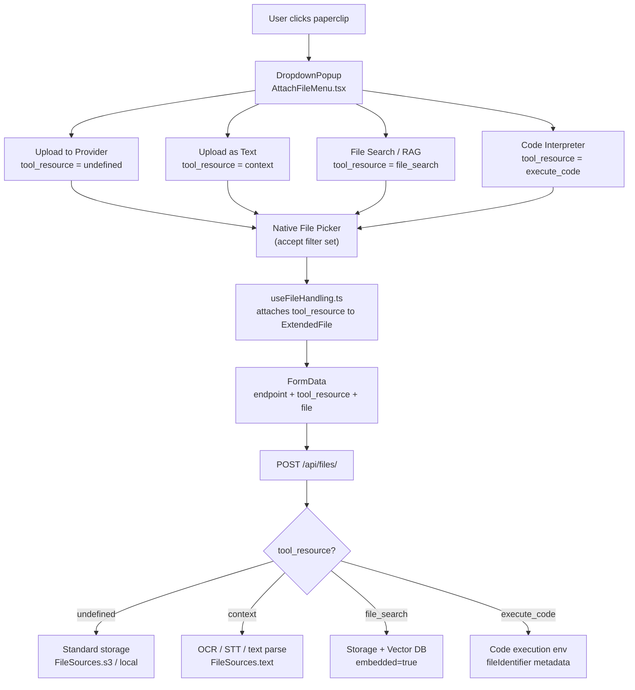
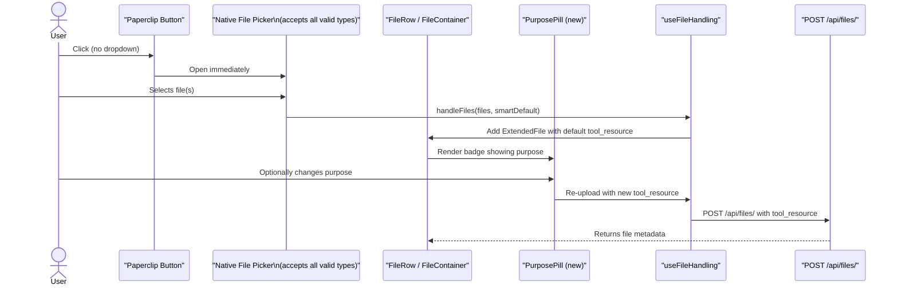
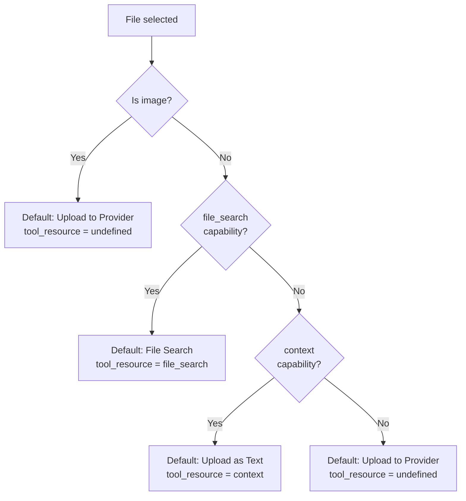
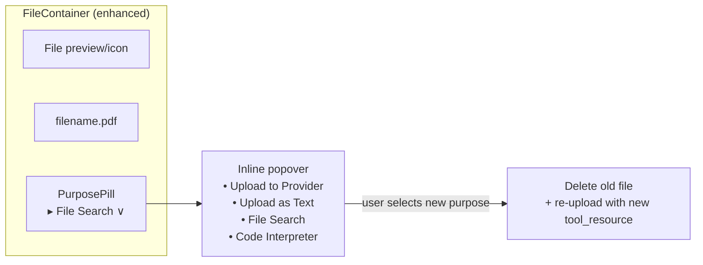
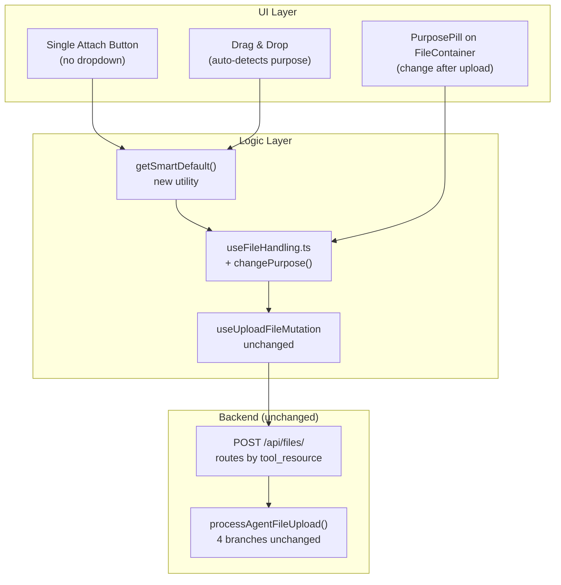

# Unified File Upload — Proposal

## Current Architecture

There are currently **four separate upload paths**, gated by a pre-pick dropdown menu (`AttachFileMenu.tsx`) and a drag-and-drop modal (`DragDropModal.tsx`). The user must decide the purpose *before* selecting the file.

### How the 4 Methods Work Today

### Key Files Involved

**Frontend**

- `[client/src/components/Chat/Input/Files/AttachFileMenu.tsx](client/src/components/Chat/Input/Files/AttachFileMenu.tsx)` — dropdown with 4 items, sets `toolResource` state before file pick
- `[client/src/components/Chat/Input/Files/DragDropModal.tsx](client/src/components/Chat/Input/Files/DragDropModal.tsx)` — same 4 options shown as modal buttons on drag-and-drop
- `[client/src/components/Chat/Input/Files/AttachFileChat.tsx](client/src/components/Chat/Input/Files/AttachFileChat.tsx)` — decides whether to render `AttachFileMenu` or `AttachFile`
- `[client/src/components/Chat/Input/Files/FileContainer.tsx](client/src/components/Chat/Input/Files/FileContainer.tsx)` — displays attached files (no tool_resource badge currently)
- `[client/src/components/Chat/Input/Files/FileRow.tsx](client/src/components/Chat/Input/Files/FileRow.tsx)` — renders the row of attached files

**Hooks / Data**

- `[client/src/hooks/Files/useFileHandling.ts](client/src/hooks/Files/useFileHandling.ts)` — core upload logic; `handleFiles(files, _toolResource)` propagates `tool_resource` into `ExtendedFile`
- `[client/src/data-provider/Files/mutations.ts](client/src/data-provider/Files/mutations.ts)` — `useUploadFileMutation`; chooses `uploadFile` vs `uploadImage` endpoint
- `[client/src/hooks/Agents/useAgentCapabilities.ts](client/src/hooks/Agents/useAgentCapabilities.ts)` — gates which methods are visible

**Backend**

- `[api/server/routes/files/files.js](api/server/routes/files/files.js)` — single `POST /api/files/` route, branches on `isAssistantsEndpoint` and `tool_resource`
- `[api/server/services/Files/process.js](api/server/services/Files/process.js)` — `processAgentFileUpload()` with 4 branches by `tool_resource`

---

## Current vs Proposed UI

Unified File Upload Mockup

**BEFORE:** User must choose the upload purpose from a 4-item dropdown *before* picking a file — no context, wrong moment.

**AFTER:** Paperclip opens the file picker directly. Each attached file card shows a colored **purpose pill** (e.g., "File Search", "Code Interpreter") that can be changed at any time by clicking it.

---

## Problem with the Current UX

1. The user must make a decision *before* seeing the file — this is counter-intuitive.
2. The dropdown is the only way to understand the difference between the 4 methods; there is no inline explanation.
3. Files attached with different `tool_resource` values look identical in `FileContainer` — no visual differentiation after upload.
4. `DragDropModal` duplicates the same logic as `AttachFileMenu`, creating two places to maintain.

---

## Proposed: Unified File Upload with Inline Purpose Selection

**Core idea:** Open a single file picker immediately. After the file is selected, show an inline purpose badge/pill on each `FileContainer` that the user can change at any time before sending. Smart defaults are applied automatically based on file type and active capabilities.

### Proposed User Flow

### Smart Default Logic

### New PurposePill Component

Each attached file in `FileContainer` gets a small interactive pill showing the current purpose. Clicking it opens a small popover to switch purposes.

---

## Files to Change

### 1. `AttachFileMenu.tsx` — Simplify to single button

- Remove the `DropdownPopup` with 4 items.
- Replace with a single `<FileUpload>` button that opens the file picker immediately.
- Accept filter becomes the union of all valid types for the current provider.
- The `toolResource` state is removed from this component.
- SharePoint submenu becomes its own separate icon button (or stays as a small secondary icon).

### 2. `DragDropModal.tsx` — Remove purpose selection

- Remove the 4-button purpose selection UI.
- Instead, call `handleFiles(files, getSmartDefault(files, capabilities))` directly.
- The modal becomes a simple "Drop files here" confirmation, or is removed entirely.

### 3. `FileContainer.tsx` — Add `PurposePill`

- Import and render a new `PurposePill` component below the filename.
- Pass `file.tool_resource` and `availablePurposes` as props.
- Wire an `onPurposeChange` callback that re-uploads the file.

### 4. New `PurposePill.tsx` — Inline purpose switcher

- Renders a small badge (e.g., "File Search", "Provider", "As Text", "Code").
- On click, shows a compact popover with the available purposes (gated by capabilities, same logic as current dropdown).
- On selection, calls `onPurposeChange(file, newToolResource)`.

### 5. `useFileHandling.ts` — Add `changePurpose` helper

- Add a new exported function `changePurpose(file: ExtendedFile, newToolResource: EToolResources | undefined)`.
- Internally: delete the existing uploaded file, then call `startUpload` with the new `tool_resource`.
- This reuses all existing upload and FormData logic.

### 6. Smart default utility — New `getSmartDefault.ts`

- Pure function: `(files: File[], capabilities: AgentCapabilitiesResult, endpoint: string) => EToolResources | undefined`
- Encapsulates the smart default logic (image → provider, doc with file_search → RAG, etc.).
- Used by both the file picker handler and the drag-and-drop handler.

### 7. `DragDropModal.tsx` and `AttachFileChat.tsx` — Minor prop changes

- Pass `onOptionSelect` a direct call using smart defaults instead of showing a chooser.

---

## Architecture After the Change

---

## What Does NOT Change

- The backend (`files.js`, `process.js`) is **completely unchanged** — it already handles all 4 `tool_resource` values perfectly.
- `useUploadFileMutation` in `mutations.ts` is **unchanged**.
- `EToolResources` enum, `ExtendedFile` type, and capability-gating logic are **unchanged**.
- The `FileRow.tsx` render structure is **unchanged** (just the `FileContainer` gets the pill added).

---

## Summary of Files to Create / Modify

- **Create** `client/src/components/Chat/Input/Files/PurposePill.tsx`
- **Create** `client/src/utils/getSmartDefault.ts`
- **Modify** `client/src/components/Chat/Input/Files/AttachFileMenu.tsx` — remove dropdown, single open
- **Modify** `client/src/components/Chat/Input/Files/DragDropModal.tsx` — remove purpose selector UI
- **Modify** `client/src/components/Chat/Input/Files/FileContainer.tsx` — add PurposePill
- **Modify** `client/src/hooks/Files/useFileHandling.ts` — add `changePurpose` helper
- **No backend changes required**

